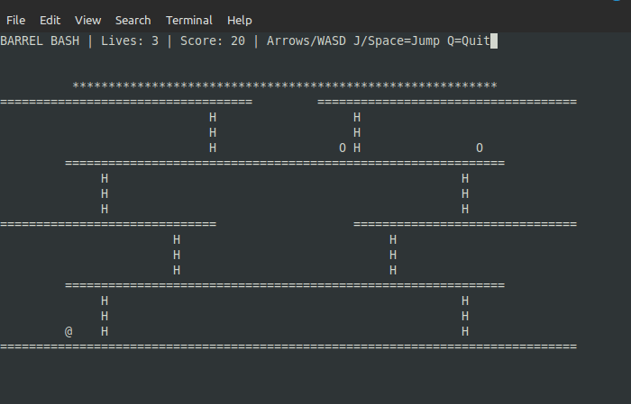

# ASCII Barrel Bash in Ada

ASCII classic platform game written in Ada.

<p align="center">
  
  
</p>



## Description

Climb to the top of the platforms while dodging rolling barrels! Use ladders to climb between platforms and reach the goal at the top.

## Controls

- **W** (or arrow up) - Climb up ladder
- **S** (or arrow down) - Climb down ladder
- **A** (or arrow left) - Move left
- **D** (or arrow right) - Move right
- **Q** - Quit game


## Build and run


```bash
make

make run
or just
./barrel_bash 
```


For best experience, use a terminal with at least 80x24 character display.

## Gameplay

- Control the player character (@) using WASD keys or arrow keys
- Climb ladders (H) to move between platforms (=)
- Avoid the rolling barrels (O)
- Reach the goal at the top (*) to win!
- Barrels spawn every 2 seconds and roll down the platforms


## Requirements

- GNAT Ada compiler
- Terminal with ANSI escape code support
- Minimum 80x24 terminal size

Enjoy the game!
